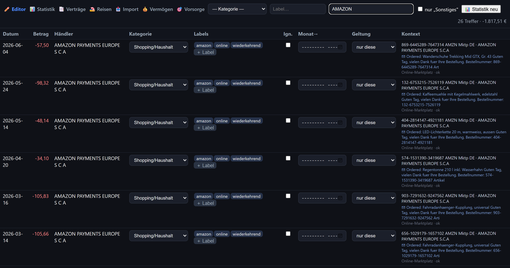

# Finanzen

*[English version](README.md) · die Anwendung selbst ist deutschsprachig.*

**Deine Kontoauszüge werden zu einer Statistik, die dir sagt, wohin das Geld geht —
auf deinem Rechner, ohne Konto bei irgendwem, und jede Zuordnung ist begründet.**

- 🔒 **Lokal.** Keine Cloud, kein Bankzugang, kein Konto. Die Daten verlassen den Rechner nicht.
- 🔍 **Nachvollziehbar.** Zu jeder Buchung steht da, *warum* sie in dieser Kategorie liegt. Was unklar ist, bleibt sichtbar unklar statt geraten zu werden.
- 🧾 **Belege statt Rätselraten.** Zu einer Buchung „AMAZON −57,50 €" steht da, *was* drin war —
  automatisch aus deinen eigenen Bestellmails verknüpft, über die Bestellnummer.
- ⚡ **Keine Installation.** Python 3.10 genügt — kein `pip install`, kein Build, kein Docker.

[](docs/bilder/statistik.png)

## In 30 Sekunden ausprobieren — ohne eigene Daten

Ein kompletter, erfundener Beispielhaushalt über 18 Monate im echten Bankformat:

```bash
git clone https://github.com/niclaseschner-ship-it/finanzen.git
cd finanzen
python beispieldaten/erzeugen.py     # Daten + Konfiguration anlegen, Pipeline laufen lassen
```

Das Skript sagt dir am Ende, wie du den Server startest. Die Demo hat ihre **eigene
Datenbank** in `beispieldaten/demo/` — sie fasst nichts an, und `beispieldaten/demo/`
löschen macht sie spurlos wieder weg.

| ✏️ Editor | 📑 Verträge | 🏖️ Reisen |
|---|---|---|
| [](docs/bilder/editor.png) | [](docs/bilder/vertraege.png) | [](docs/bilder/reisen.png) |
| Kategorie, Labels — und die Begründung | Fixkosten, allein aus der Wiederholung erkannt | Urlaube, allein aus den Einkaufsorten erkannt |

Die Demo bringt auch **Beleg-Mails** mit (als echtes mbox, genau wie Thunderbird es
anlegt) — die Belegverknüpfung lässt sich also sofort sehen. Sie zeigt absichtlich auch,
was **nicht** aufgeht: ein paar Händler bleiben `unkategorisiert`, statt geraten zu werden.
Ohne eigene Daten leer bleibt nur die **Vermögens**-Ansicht (die braucht gepflegte Zahlen);
die Vorsorge-Rechnung lässt sich sofort durchspielen.

## Wie es funktioniert

Eine SQLite-Datei ist die einzige Wahrheit; alle Auswertungen werden daraus
**reproduzierbar** neu berechnet. Buchungen kommen 1:1 aus den Bankdaten und werden nie
erfunden; Kategorien und Labels sind eine ableitbare Schicht, die jederzeit neu rechenbar
ist. Nichts wird still gelöscht — Status statt Löschen.

Unterstützt werden die CSV-Exporte von **DKB** und **GLS**. Andere Banken brauchen ein
paar Zeilen in [`scripts/parse_konten.py`](scripts/parse_konten.py) — Beiträge willkommen,
siehe [Mitarbeiten](#mitarbeiten).

## 🧾 Belege aus E-Mails — was war eigentlich in dem Paket?

Der Kontoauszug sagt „AMAZON PAYMENTS EUROPE S.C.A, −57,50 €". Das ist die Stelle, an der
jedes Haushaltsbuch aufhört und man selbst im Postfach sucht. Diese App macht den Schritt
mit: sie verknüpft Buchungen mit deinen **eigenen Bestell- und Zahlungsmails** und zeigt
die Produktzeile direkt an der Buchung.

[](docs/bilder/belege.png)

**Mechanisch, nicht geraten** — und jede Verknüpfung sagt, wie sicher sie ist:

| Weg | Sicherheit |
|---|---|
| Bestellnummer aus dem Verwendungszweck steht in der Mail | **sicher** |
| PayPal-Transaktions-ID | **sicher** |
| PayPal-Händler + Betrag im Zeitfenster | gut |
| Händler + Betrag + Datum (±5 Tage) | Schätzung, im Editor als solche markiert |

Bei mehrdeutigen Fällen wird **nicht** verknüpft — eine falsche Zuordnung wäre schlimmer
als gar keine. PDF-Anhänge werden gespeichert und ihr Text mitdurchsucht (dafür das
optionale `pymupdf`), sodass auch Rechnungen im Anhang gefunden werden.

**Woher die Mails kommen:** aus **Thunderbird**. Der Import liest mbox-Dateien, und
Thunderbird legt genau die an. Deshalb der Umweg statt eines eigenen Postfachzugriffs:
**diese App bekommt nie dein Mail-Passwort**, die Nachrichten liegen lokal, und du
entscheidest pro Ordner, was importiert wird.

```bash
python scripts/einrichten.py --mail    # findet die Profile, listet die Ordner mit Größe
```

Wichtig ist ein Schritt, den man leicht übersieht: In Thunderbird unter
*Konten-Einstellungen → Synchronisation & Speicherplatz* muss „Mails auf diesem Computer
speichern" aktiv sein — sonst sind die mbox-Dateien leer. Der Import ist idempotent,
abbrechen und später fortsetzen ist gefahrlos.

E-Mails sind dabei **ausschließlich Kontext, nie eine Buchungsquelle**: Beträge und
Buchungen kommen immer 1:1 aus der Bank. Ohne Mails funktioniert alles, die Detailspalte
bleibt nur leerer.

## Wann dieses Projekt — und wann ein anderes

Es gibt ausgereifte Alternativen, und für viele Leute sind sie die bessere Wahl. Diese
hier ist absichtlich klein und deckt einen schmalen Fall ab:

| Nimm … | wenn du … |
|---|---|
| **[Firefly III](https://github.com/firefly-iii/firefly-iii)** | doppelte Buchführung, Budgets, mehrere Nutzer, Handy-App und Anbindung an Banking-APIs willst. Der Platzhirsch — deutlich mehr Funktionen, dafür Server, Datenbank und Einarbeitung. |
| **[Actual Budget](https://github.com/actualbudget/actual)** | nach der Umschlagmethode budgetieren willst (YNAB-Stil), also **vorausplanen** statt rückblickend auswerten. |
| **[beancount](https://beancount.github.io/) / hledger** | Klartext-Buchhaltung magst und deine Auswertungen selbst schreibst. |
| **dieses Projekt** | wissen willst, **wo dein Geld hingegangen ist**, ohne dafür ein System aufzusetzen — und ohne dass eine Software je dein Bank- oder Mail-Passwort sieht. |

Was es hier gibt und dort nicht:

- **Belegverknüpfung aus dem eigenen Postfach.** Zu „AMAZON −57,50 €" steht die Produktzeile
  aus deiner Bestellmail. Belegabgleich existiert sonst vor allem als kommerzielles SaaS für
  Spesenabrechnung, oder bei [Midday](https://github.com/midday-ai/midday) für Selbstständige.
- **Begründungspflicht.** Jede Kategorie trägt ihre Quelle. Was unklar ist, bleibt sichtbar
  unklar — es wird nichts geraten, damit die Statistik hübsch aussieht.
- **Kein Setup.** Kein Server, kein Docker, keine Datenbank-Installation, kein `pip install`.
- **Reise- und Vertragserkennung** allein aus den Buchungsmustern, ohne dass du etwas anlegst.

Was es hier **nicht** gibt: Budgets und Sollwerte, Mehrbenutzerbetrieb, Handy-App,
automatischen Bankabruf (bewusst — das hieße Zugangsdaten), Fremdwährungskonten,
doppelte Buchführung. Und die CSV-Formate sind bisher **DKB und GLS**.

## Voraussetzungen
- **Python 3.10+** — der Kern nutzt nur die **Standardbibliothek** (kein `pip install` nötig).
- Optional: **PyMuPDF** (`pip install pymupdf`) — nur für Text aus PDF-Mailanhängen.
- **Kein Internet nötig.** Chart.js liegt im Projekt (`scripts/seiten/chart.min.js`) und
  wird neben die erzeugte Seite gelegt — die Seite trägt alle Buchungen in sich, da hat
  ein Skript von fremdem Server nichts zu suchen.

## Einrichtung
Es gibt **nichts zu installieren** außer Python — die Arbeit ist Konfiguration. Der
geführte Weg liest die Kontoexporte und fragt nur, was in keiner CSV steht:

```bash
cd scripts
python einrichten.py --pruefen   # rein lesend: was steckt in den Exporten?
python einrichten.py             # erzeugt konfig.json
python einrichten.py --mail      # optional: Belege aus Thunderbird
```

Wer Claude Code nutzt, kann stattdessen den mitgelieferten Skill
`finanz-einrichtung` ([`.claude/skills/`](.claude/skills/)) starten — der geht
zusätzlich das Ergebnis durch und sucht nach typischen Einrichtungsfehlern.

## Konfiguration — `konfig.json`
Alles, was von Haushalt zu Haushalt anders ist, steht in **einer** Datei im Projektordner.
**Kein Quellcode-Editieren nötig.** Von Hand geht es auch:

```bash
copy konfig.beispiel.json konfig.json     # Vorlage kopieren, dann ausfüllen
cd scripts && python konfig.py            # prüft die Datei und zeigt, was gelesen wurde
```

| Abschnitt | Was drin steht | Warum es wichtig ist |
|---|---|---|
| `konten.eigene_giro` | eigene Girokonten (IBAN → Name) | **Systemgrenze.** Überweisungen zwischen diesen Konten sind keine Ausgaben. Fehlt hier ein Konto, ist die Statistik zu hoch. |
| `konten.zuordnung` | Depot, Darlehen, Gehalt, Kindergeld | zählen mit, bekommen aber eine feste Vorgabe-Kategorie, die keine Händlerregel überschreibt |
| `kategorien` | die feste Kategorienliste | genau eine pro Buchung; eigene ergänzen (z.B. „Immobilie X") |
| `haushalt.heimat_orte` | Wohnort + Nachbarorte | Reise-Erkennung. Ohne das ist der Alltag eine Dauerreise. |
| `haushalt.eigene_namen` | Familien-/Vermieternamen | verhindert, dass Privatmails als Beleg-Kontext an Buchungen landen |
| `eigene_regeln` | Hausverwaltung, Vermieter, Stammlokal | die breiten Regeln für gängige Händler sind in [`scripts/rules.py`](scripts/rules.py) eingebaut |

`konfig.json` ist **nicht** im Git (siehe [`.gitignore`](.gitignore)) — versioniert ist nur
die Vorlage. Solange keine `konfig.json` existiert, läuft die Beispielkonfiguration: Server
und Seiten starten, aber `run_all.py` **verweigert** den Lauf. Mit fremder Kontenkarte wären
die Auswertungen still falsch, und das ist schlimmer als ein Abbruch.

Die Vermögensansicht hat ihre eigene gepflegte Datei — Vorlage:
[`vermoegen/positionen.beispiel.json`](vermoegen/positionen.beispiel.json).

## Konfiguration (Pfade)
Alle Pfade stehen an **einer** Stelle in [`scripts/db.py`](scripts/db.py) und sind per
Umgebungsvariable überschreibbar:

| Env-Variable | Default | Bedeutung |
|---|---|---|
| `FINANZEN_BASE` | der Ordner dieses Repos | Projektordner: DB, `output/`, `attachments/` |
| `FINANZEN_BANK` | `<BASE>\konten` | Eingang für Bank-CSV-Exporte (= Upload-Ziel) |
| `FINANZEN_BANK_CSV` | `<BASE>\output\transaktionen.csv` | zusammengeführte Konto-CSV |
| `FINANZEN_PORT` | `8765` | Port des Servers — eigener Port, wenn eine zweite Instanz (z.B. die Demo) parallel laufen soll |

Die Defaults sind **relativ zum Repo** — ein frischer Clone läuft ohne gesetzte
Umgebungsvariablen. Setzen muss man sie nur, wenn Daten woanders liegen sollen:

```bash
# Beispiel: Kontoexporte liegen auf einem anderen Laufwerk
set FINANZEN_BANK=D:\bank-exporte
```

## Schnellstart
1. **Bank-Exporte ablegen:** DKB-/GLS-CSV nach `konten/` kopieren
   (oder später über die Import-Seite hochladen). Format wird automatisch erkannt.
   Sinnvoll sind mindestens 12 Monate — Vertrags- und Reise-Erkennung brauchen
   Wiederholungen.
2. **Konfiguration anlegen:** `python scripts/einrichten.py` (oder die Vorlage
   `konfig.beispiel.json` von Hand ausfüllen). Prüfen: `python scripts/konfig.py`.
3. **Pipeline laufen lassen** (idempotent, beliebig oft wiederholbar):
   ```bash
   cd scripts
   python run_all.py
   ```
4. **Editor/Statistik starten:**
   ```bash
   python app.py     # -> http://localhost:8765
   ```

## Die Seiten (alle unter http://localhost:8765)
- **✏️ Editor** (`/`) — jede Buchung prüfen, Kategorie/Labels/Kommentar setzen.
- **📊 Statistik** (`/statistik.html`) — Einnahmen/Ausgaben pro Monat, Kategorie-Stack,
  Ranking, Reisen. Filter: Jahr · Kategorien · Verträge · Label. Balken anklicken → Buchungen.
- **📑 Verträge** (`/vertraege`) — mechanisch erkannte wiederkehrende Zahlungen (= Fixkosten),
  bestätigen/ablehnen, aktiv/ausgelaufen.
- **🏖️ Reisen** (`/reisen`) — automatisch erkannte Reisen (zusammenhängend außerhalb der
  Heimatregion), bestätigen → Buchungen werden zu „Urlaub".
- **📥 Import** (`/import`) — alle Datenquellen mit Zeitraum/Stand, Zeitachse + Regler für den
  berücksichtigten Zeitraum, Bank-CSV-Upload und „Daten verarbeiten".

## Aufbau
- `scripts/` — der Kern (Pipeline + Server). Details & Reihenfolge: [`PROCESS.md`](PROCESS.md).
- `scripts/extra/` — optionale/einmalige Werkzeuge (Text-Report, KI-Seed, Alt-Dashboard),
  nicht Teil des Hauptlaufs.
- `vermoegen/` — Vermögens-Snapshot (Salden/Bestände statt Umsätze), eigener Lauf.
- `konten/` — **Eingang** für Bank-CSV-Exporte · `output/` — generierte Seiten ·
  `attachments/` — gespeicherte Mailanhänge · `finanzen.db` — die Datenbank.
- `beispieldaten/` — erfundener Demo-Haushalt zum Ausprobieren · `demo/` — anonymisierte
  Beispielseite · `docs/bilder/` — Screenshots ·
  [`DECISIONS.md`](DECISIONS.md) — Protokoll der Entscheidungen.
- `tests/` — Tests, reine Standardbibliothek: `python -m unittest discover -s tests -t tests`

**Versioniert ist nur Code und Doku.** Datenbank, Kontoexporte, Anhänge, generierte
Seiten und persönliche Konfiguration sind per `.gitignore` ausgeschlossen — dieses Repo
lässt sich weitergeben, ohne Bankdaten mitzuliefern.

## Daten & Privatsphäre
Alles bleibt **lokal**. Der Server hört ausschließlich auf `127.0.0.1` und weist Anfragen
mit fremdem `Host`- oder `Origin`-Header ab — sonst könnte eine beliebige Webseite im
selben Browser mitlesen oder schreiben.

Nach außen geht genau eine Sache, und nur wenn die OSM-Branchen-Erkennung läuft:
**Händlername + Ort** an OpenStreetMap/Nominatim (keine Beträge, keine Kontonummern).
Beachte, dass Händlernamen kleiner Betriebe oft Personennamen sind. Die Bankdaten und
die Datenbank verlassen den Rechner nie.

## Mitarbeiten
Wer die Anwendung mit eigenen Daten benutzt, findet Dinge, die sonst niemand findet: eine
Bank, deren Format klemmt, einen Händler, den keine Regel trifft, eine missverständliche
Stelle in der Anleitung. Das ist der wertvollste Beitrag — bitte als Branch zurückgeben:

```bash
git checkout -b erfahrung/<kurzer-name>
python -m unittest discover -s tests -t tests    # bleibt alles grün?
git commit -am "fix: <was>"
git push -u origin erfahrung/<kurzer-name>
```

| Fund | Wohin |
|---|---|
| Händler, den viele Haushalte haben (Supermarkt, Versicherer, Stromanbieter, Streaming) | `SEED2` in [`scripts/rules.py`](scripts/rules.py) |
| Händler, den nur dein Haushalt hat | `eigene_regeln` in deiner `konfig.json` — **nicht** committen |
| Bankformat wird nicht erkannt | [`scripts/parse_konten.py`](scripts/parse_konten.py) + ein Test |
| Anleitung war missverständlich | `README.md` / `PROCESS.md` |
| Entscheidung getroffen, die nicht offensichtlich ist | `DECISIONS.md` |

**Vor dem Push kurz `git diff --cached` ansehen.** Die `.gitignore` deckt Datenbank,
Exporte, Anhänge und `konfig.json` ab — aber eine Regel mit dem Namen deines Vermieters
gehört trotzdem nicht in `rules.py`. Der Prüfmaßstab ist nicht „stehen hier IBANs?",
sondern: **könnte diese Zeile bei einem beliebigen anderen Haushalt genauso stehen?**
Ein hyperlokaler Laden, ein Kindergarten, der Name einer Haushaltshilfe — das ist keine
Regel, sondern eine Beobachtung über eine bestimmte Familie an einem bestimmten Ort.
Solche Muster gehören in die eigene `konfig.json`.

### Was beim Prüfen eines fremden Beitrags besonders zählt
Vier Stellen richten mit einer einzigen Zeile großen Schaden an — bei Änderungen daran
bitte genau hinsehen:

| Datei | Warum |
|---|---|
| `scripts/app.py` (Bind-Adresse) | `127.0.0.1` → `0.0.0.0` hängt den gesamten Datenbestand samt Schreib-Schnittstelle ins Netz |
| `.gitignore` | eine entfernte Zeile, und beim nächsten `git commit -am` wandern echte Bankdaten unwiderruflich in die öffentliche History |
| `scripts/frontend.py` / `liste.py` (Einbettung) | hier wird fremdbestimmter Text in die Seite geschrieben; ohne Maskierung ist das eine Lücke |
| `.claude/skills/**` | wird von einem Agenten **ausgeführt**, nicht nur gelesen |
