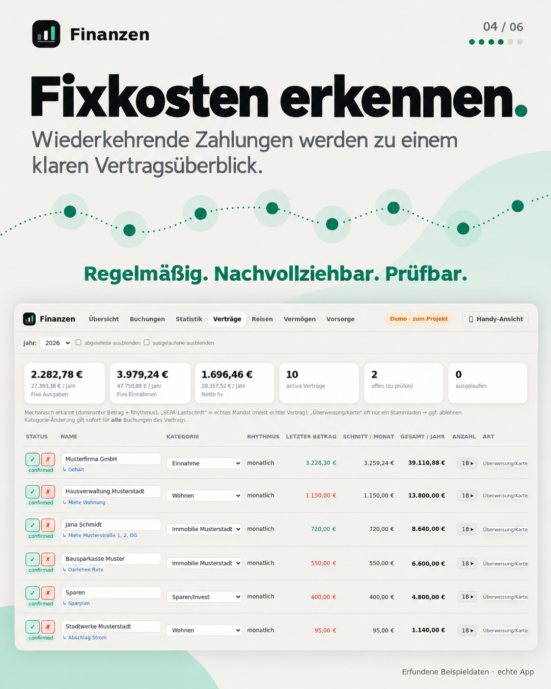

# Finanzen

*[Deutsche Fassung](README.de.md) · the application itself is in German.*

**Understand what a payment was for — by connecting bank transactions with your order emails.**

A bank statement says “AMAZON −12.18 €”. The matching order email says “Thermos flask”.
Finanzen brings them together: the bank provides the amount, the email adds the purchase context.
Order numbers and payment IDs link receipts; ambiguous matches stay visibly uncertain.

- **Bank + email.** Product details beside the transaction, without counting an email as a second payment.
- **One overview.** Monthly spending, categories, recurring costs, accounts, portfolio, property and loans.
- **Your decision.** Review unclear suggestions, correct categories and keep your own decisions across imports.
- **On your own computer or server.** Python 3.10+, SQLite, desktop view and an installable phone app (PWA).
  Bank CSVs and locally available emails provide the data; no bank or email password is needed by the app.

**[▶ Try the live demo](https://niclaseschner-ship-it.github.io/finanzen/demo/)** · [Quick start](#try-it--without-your-own-data) · [How receipt matching works](#-receipts-from-emails--what-was-actually-in-that-package)

## Six views of the app

The screenshots use a completely invented household. The product posters are based on captures of the real demo pages.

<table>
<tr>
<td><a href="docs/produktdemo/01-konto-mail.png"></a></td>
<td><a href="docs/produktdemo/02-monat.png"></a></td>
</tr>
<tr>
<td><a href="docs/produktdemo/03-pruefen.png"></a></td>
<td><a href="docs/produktdemo/04-fixkosten.png"></a></td>
</tr>
<tr>
<td><a href="docs/produktdemo/05-statistik.png"></a></td>
<td><a href="docs/produktdemo/06-vermoegen.png"></a></td>
</tr>
</table>

[Original screenshots and generation prompts](docs/produktdemo/README.md).

## Try it — without your own data

```bash
git clone https://github.com/niclaseschner-ship-it/finanzen.git
cd finanzen
python scripts/app.py        # -> http://localhost:8765/finanzen/
```

As long as there is no data of your own, the app shows a **complete invented household**:
18 months, two accounts in two bank formats, salary, rent, fixed costs, a rented-out flat with a
loan, savings account and portfolio, order emails as a real mbox, two trips. It is created on
first start in `beispieldaten/demo/` — its own database and configuration, marked "Beispieldaten"
(sample data) at the top right. Recreate it: `python beispieldaten/erzeugen.py`.

## How it works

Raw **bank statements** — enriched with **email receipts** — become a searchable, categorised
spending report. One SQLite file is the single source of truth; every report is recomputed from
it **reproducibly**.

**Data sources**

- 🏦 **Bank accounts (CSV)** — format detected automatically, overlapping exports deduplicated.
  The transaction is the truth of money flows. Supported: **DKB** and **GLS**; other banks need
  a few lines in [`scripts/parse_konten.py`](scripts/parse_konten.py) — contributions welcome.
- 📧 **Mailboxes** (mbox, e.g. from Thunderbird) — provide receipts and product details,
  "PayPal *Ref" becomes "running shoes". Context only, never a transaction.
- 🗺️ **OpenStreetMap** — unknown card merchants are looked up once (industry → category) and
  cached. No key, no amounts sent anywhere.
- 🧠 **AI, only for the rest** — for unclear leftovers a reviewable suggestion with confidence
  and justification. Your own correction always wins.

**Flow** — an idempotent pipeline (`scripts/run_all.py`), repeatable at will; manual decisions
survive via stable transaction IDs:

1. **Merge accounts** — combine all exports, deduplicate overlaps robustly
2. **Ingest + system boundary** — internal transfers out, savings/loan/income marked
3. **Enrich** — payment type, merchant, place, real purchase date, creditor ID, recurring
4. **Match receipts** — transaction ↔ email (order number, PayPal ID, amount+merchant+date)
5. **Categorise** — rules, trips, contracts; exactly one category, any number of labels
6. **Report** — every question is a filter + group-by over the same transactions

**The categorisation funnel** — from the safest source to the least safe; nothing that fails to
match is dropped, it lands visibly in "Sonstiges" (other): system boundary (own accounts,
account map) → rules (creditor ID before merchant keyword) → industry lookup → AI suggestion →
manual correction (beats everything) → trip detection (stamps confirmed trips as vacation).

**Principles**

- **Raw data untouchable** — transactions come 1:1 from the bank and are never invented.
  Categories and labels are a derived layer.
- **Nothing disappears silently** — status instead of deletion.
- **Mechanics before AI** — deterministic rules first; AI is the scalpel for the rest.
- **Your own data store** — bank and mail data are processed locally. Optional merchant lookups and AI categorisation are separate steps.

## 🧾 Receipts from emails — what was actually in that package?

The bank statement says "AMAZON PAYMENTS EUROPE S.C.A, −57.50 €". Without purchase context, you have to search the mailbox yourself. This app takes that
step with you: it links transactions to your **own order and payment emails** and shows
the product line right next to the transaction.


**Mechanical, not guessed** — and every link states how certain it is:

| Path | Certainty |
|---|---|
| Order number from the payment reference appears in the email | **certain** |
| PayPal transaction ID | **certain** |
| PayPal merchant + amount within a time window | good |
| Merchant + amount + date (±5 days) | estimate, marked as such in the editor |

Ambiguous cases are **not** linked — a wrong match would be worse than none. PDF
attachments are stored and their text is searched too (that is what the optional
`pymupdf` is for), so invoices inside attachments are found as well.

**Where the emails come from:** **Thunderbird**. The import reads mbox files, and
Thunderbird creates exactly those. Hence the detour instead of direct mailbox access:
**this app never gets your email password**, the messages stay local, and you decide
per folder what gets imported.

```bash
python scripts/einrichten.py --mail    # finds the profiles, lists the folders with sizes
```

One step is easy to miss: in Thunderbird under *Account Settings → Synchronization &
Storage*, "Keep messages on this computer" must be enabled — otherwise the mbox files are
empty. The import is idempotent; interrupting and resuming later is safe.

Emails are **context only, never a transaction source**: amounts and transactions always
come 1:1 from the bank. Everything works without emails — the detail column just stays
emptier.

## When to use this project — and when another

There are mature alternatives, and for many people they are the better choice. This one is
deliberately small and covers a narrow case:

| Use … | if you … |
|---|---|
| **[Firefly III](https://github.com/firefly-iii/firefly-iii)** | want double-entry bookkeeping, budgets, multiple users, a mobile app and banking-API connections. The incumbent — far more features, at the cost of a server, a database and a learning curve. |
| **[Actual Budget](https://github.com/actualbudget/actual)** | want envelope budgeting (YNAB style), i.e. **plan ahead** instead of analysing in hindsight. |
| **[beancount](https://beancount.github.io/) / hledger** | like plain-text accounting and write your own reports. |
| **this project** | want to know **where your money went** without setting up a system — and without any software ever seeing your bank or email password. |

What this project focuses on:

- **Receipt linking from your own mailbox.** Next to "AMAZON −57.50 €" you see the product
  line from your order email. Receipt matching otherwise exists mainly as commercial SaaS
  for expense reports, or in [Midday](https://github.com/midday-ai/midday) for freelancers.
- **Justification requirement.** Every category carries its source. What is unclear stays
  visibly unclear — nothing is guessed to make the statistics look tidy.
- **Small runtime.** Python and SQLite, without Docker or a separate database service.
- **Trip and contract detection** purely from transaction patterns, without you creating anything.

What does **not** exist here: budgets and targets, multi-user operation, native iOS/Android apps,
automatic bank fetching (deliberately — that would mean credentials), foreign-currency
accounts, double-entry bookkeeping. And the CSV formats so far are **DKB and GLS**.

## Requirements
- **Python 3.10+** — the core uses only the **standard library** (no `pip install` needed).
- Optional: **PyMuPDF** (`pip install pymupdf`) — only for text from PDF email attachments.
- **No internet needed.** Chart.js ships inside the project (`scripts/seiten/chart.min.js`)
  and is placed next to the generated page — the page carries all transactions in itself,
  so a script from a foreign server has no business there.

## From the demo to your own numbers

There is **nothing to install** except Python — the work is configuration. The path is the same
household, replaced area by area with your own data:

1. **Accounts and account map** — your CSV exports into `konten/` (at least 12 months), then
   `python scripts/einrichten.py`. It reads the exports and only asks what no CSV contains
   (which accounts are yours, home towns). As soon as `konfig.json` is in the project folder,
   the app shows your own numbers; the demo stays in `beispieldaten/demo/`.
2. **Receipts** (optional) — `python scripts/einrichten.py --mail` reads mbox files, e.g. from
   Thunderbird.
3. **Wealth** (optional) — copy `vermoegen/positionen.beispiel.json` to
   `vermoegen/positionen.json` and fill it in; the demo shows what it looks like.
4. **Retirement planning** — directly on the page; actual values come from the transactions.

If you use Claude Code, start the bundled skill **`finanz-einrichtung`**
([`.claude/skills/`](.claude/skills/)): it walks through these steps, checks suggestions before
they go into the configuration, and questions the result.

```bash
cd scripts
python einrichten.py --pruefen   # read-only: what is in the exports?
python einrichten.py             # creates konfig.json
python einrichten.py --mail      # optional: receipts from Thunderbird
```

**Every month:** new exports into `konten/` and `python run_all.py`. There is deliberately no
import page. With Claude Code the skill `finanz-monatsimport` does this: it checks that the
exports connect without gaps, categorises the unclear rest with a justification and reports
what stands out — missing rent, expired contracts, new trips.

## Configuration — `konfig.json`
Everything that differs from household to household lives in **one** file in the project
folder. **No source-code editing required.** Doing it by hand works too:

```bash
copy konfig.beispiel.json konfig.json     # copy the template, then fill it in
cd scripts && python konfig.py            # validates the file and shows what was read
```

| Section | What it holds | Why it matters |
|---|---|---|
| `konten.eigene_giro` | your own checking accounts (IBAN → name) | **System boundary.** Transfers between these accounts are not expenses. If an account is missing here, the statistics are too high. |
| `konten.zuordnung` | brokerage, loans, salary, child benefit | counted, but with a fixed default category that no merchant rule overrides |
| `kategorien` | the fixed category list | exactly one per transaction; add your own (e.g. "Immobilie X") |
| `haushalt.heimat_orte` | home town + neighbouring towns | trip detection. Without it, everyday life is one endless trip. |
| `haushalt.eigene_namen` | family/landlord names | prevents private emails from landing as receipt context on transactions |
| `eigene_regeln` | property manager, landlord, favourite restaurant | the broad rules for common merchants are built into [`scripts/rules.py`](scripts/rules.py) |

`konfig.json` is **not** in git (see [`.gitignore`](.gitignore)) — only the template is
versioned. As long as no `konfig.json` exists, the example configuration runs: server and
pages start, but `run_all.py` **refuses** to run. With a foreign account map the reports
would be silently wrong, and that is worse than an abort.

The assets view has its own maintained file — template:
[`vermoegen/positionen.beispiel.json`](vermoegen/positionen.beispiel.json).

## Configuration (paths)
All paths live in **one** place in [`scripts/db.py`](scripts/db.py) and can be overridden
via environment variables:

| Env variable | Default | Meaning |
|---|---|---|
| `FINANZEN_BASE` | this repo's folder — or `beispieldaten/demo/` as long as there is no own data (`konfig.json`, `finanzen.db`) | data folder: DB, `output/`, `attachments/` |
| `FINANZEN_BANK` | `<BASE>\konten` | inbox for bank CSV exports |
| `FINANZEN_BANK_CSV` | `<BASE>\output\transaktionen.csv` | merged account CSV |
| `FINANZEN_PORT` | `8765` | server port — use a different one if a second instance (e.g. the demo) runs in parallel |

The defaults are **relative to the repo** — a fresh clone runs without any environment
variables set. You only set them if the data should live elsewhere:

```bash
# example: account exports live on another drive
set FINANZEN_BANK=D:\bank-exporte
```

## Quickstart (own data, without assistant)
1. Copy DKB/GLS CSVs into `konten/` (at least 12 months).
2. `python scripts/einrichten.py` — or fill in the template `konfig.beispiel.json` as
   `konfig.json` by hand. Check: `python scripts/konfig.py`.
3. `cd scripts && python run_all.py` (idempotent, repeatable)
4. `python app.py` → http://localhost:8765/finanzen/

## The pages (all under http://localhost:8765/finanzen/)
- **Overview** (`/finanzen/`) — the month against the average, key figures, categories.
  On a phone the same address opens the phone app.
- **Transactions** (`/finanzen/editor`) — review every transaction, set category/labels/comment.
- **Statistics** (`/finanzen/statistik.html`) — income/expenses per month, category stack,
  ranking, trips. Filters: year · categories · contracts · label. Click a bar → transactions.
- **Contracts** (`/finanzen/vertraege`) — mechanically detected recurring payments (= fixed costs),
  confirm/reject, active/expired.
- **Trips** (`/finanzen/reisen`) — automatically detected trips (contiguous spending outside the
  home region), confirm → transactions become "Urlaub" (vacation).
- **Wealth** (`/finanzen/vermoegen`) — accounts, portfolio, property with valuation range, loans.
- **Retirement** (`/finanzen/vorsorge`) — year-by-year planning, with actual values from the transactions.

## Layout
- `scripts/` — the core (pipeline + server). Details & order: [`PROCESS.md`](PROCESS.md).
- `scripts/extra/` — optional/one-off tools (text report, AI seed, legacy dashboard),
  not part of the main run.
- `vermoegen/` — assets snapshot (balances/holdings instead of transactions), separate run.
- `konten/` — **inbox** for bank CSV exports · `output/` — generated pages ·
  `attachments/` — stored email attachments · `finanzen.db` — the database.
- `beispieldaten/` — generator of the invented demo household · `demo/` — the online demo: the
  real pages with the demo household, built by `demo/bauen.py` · `docs/bilder/` — screenshots ·
  [`DECISIONS.md`](DECISIONS.md) — log of decisions.
- `tests/` — tests, pure standard library: `python -m unittest discover -s tests -t tests`

**Only code and docs are versioned.** Database, account exports, attachments, generated
pages and personal configuration are excluded via `.gitignore` — this repo can be shared
without shipping bank data.

## Data & privacy
Everything stays **local**. The server listens exclusively on `127.0.0.1` and rejects
requests with a foreign `Host` or `Origin` header — otherwise any website in the same
browser could read or write along.

Exactly one thing goes outside, and only when OSM merchant-type detection runs:
**merchant name + town** to OpenStreetMap/Nominatim (no amounts, no account numbers).
Note that merchant names of small businesses are often personal names. The bank data and
the database never leave the machine.

## Contributing
Whoever uses the application with their own data finds things nobody else can find: a bank
whose format misbehaves, a merchant no rule matches, a confusing spot in the guide. That is
the most valuable contribution — please return it as a branch:

```bash
git checkout -b erfahrung/<short-name>
python -m unittest discover -s tests -t tests    # everything still green?
git commit -am "fix: <what>"
git push -u origin erfahrung/<short-name>
```

| Finding | Where it goes |
|---|---|
| Merchant that many households have (supermarket, insurer, utility, streaming) | `SEED2` in [`scripts/rules.py`](scripts/rules.py) |
| Merchant only your household has | `eigene_regeln` in your `konfig.json` — do **not** commit |
| Bank format not recognised | [`scripts/parse_konten.py`](scripts/parse_konten.py) + a test |
| Guide was confusing | `README.md` / `PROCESS.md` |
| Non-obvious decision made | `DECISIONS.md` |

**Look at `git diff --cached` before pushing.** The `.gitignore` covers database, exports,
attachments and `konfig.json` — but a rule carrying your landlord's name still does not
belong in `rules.py`. The yardstick is not "are there IBANs in here?", but: **could this
line appear unchanged in any other household?** A hyper-local shop, a kindergarten, the
name of a domestic helper — that is not a rule but an observation about one specific family
in one specific place. Such patterns belong in your own `konfig.json`.

### What matters most when reviewing someone else's contribution
Four spots can do great damage with a single line — please look closely at changes there:

| File | Why |
|---|---|
| `scripts/app.py` (bind address) | `127.0.0.1` → `0.0.0.0` exposes the entire dataset including the write interface to the network |
| `.gitignore` | one removed line, and the next `git commit -am` pushes real bank data irrevocably into public history |
| `scripts/frontend.py` / `liste.py` (embedding) | externally controlled text is written into the page here; without escaping this is a hole |
| `.claude/skills/**` | gets **executed** by an agent, not just read |
