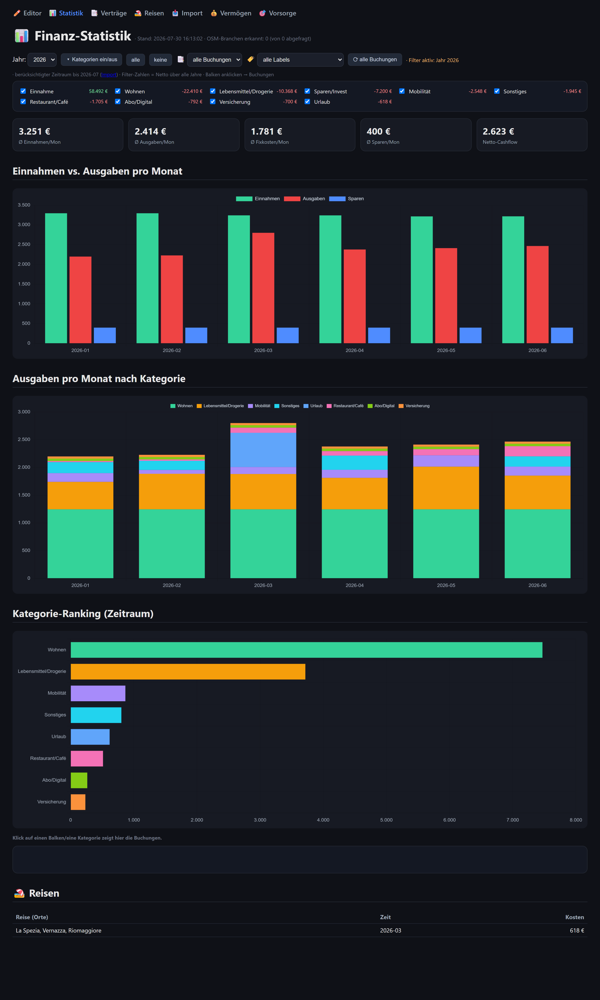
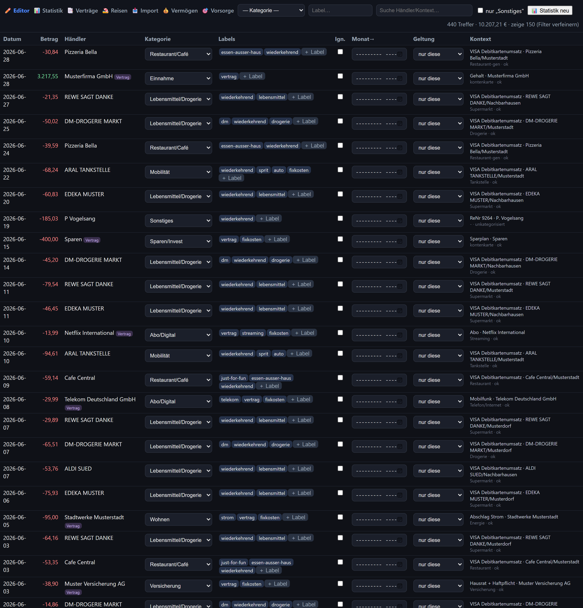
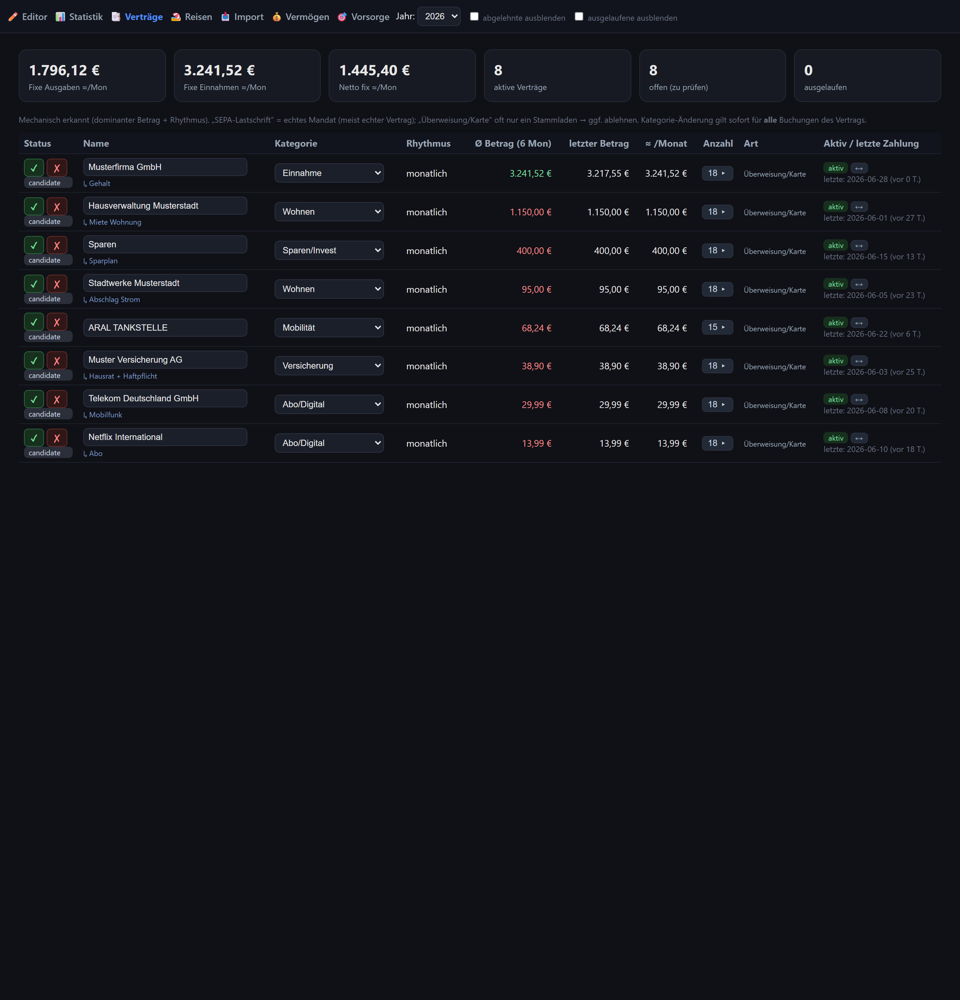
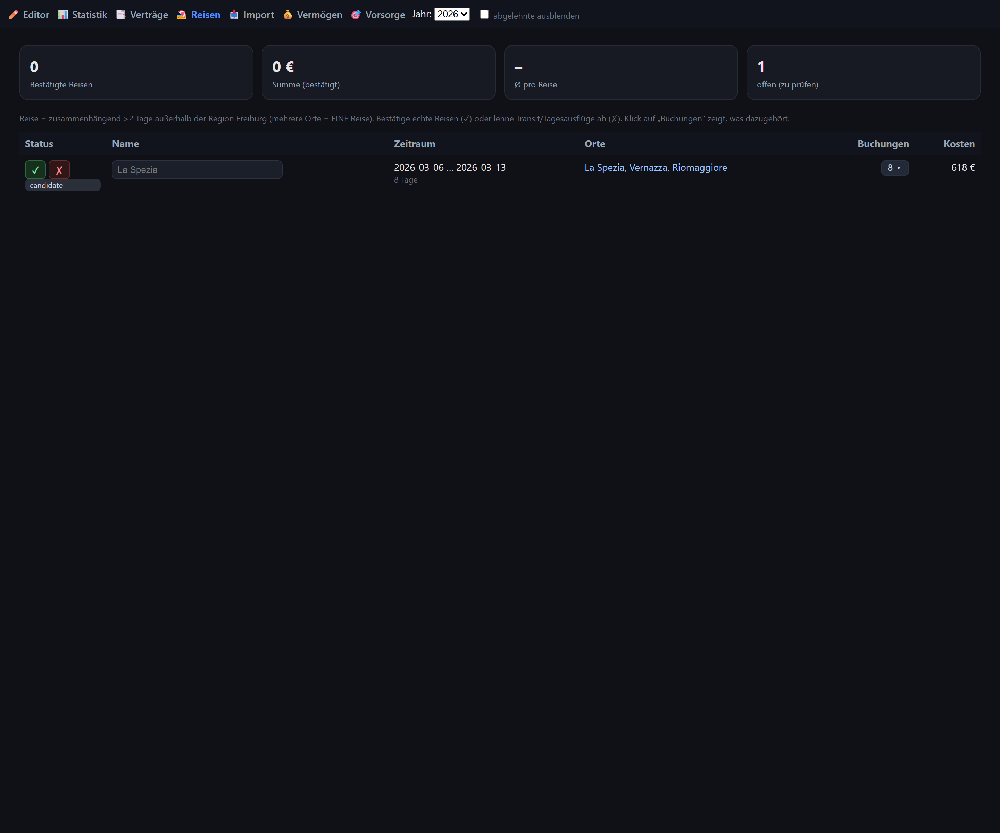

# Finanzen — lokale, mechanische Ausgaben-Auswertung

Eine kleine, **lokal laufende** Anwendung, die Kontoauszüge (+ optional E-Mails als Belege)
in eine durchsuchbare, kategorisierte Ausgaben-Statistik verwandelt. Eine SQLite-Datei ist
die einzige Wahrheit; alle Auswertungen werden daraus **reproduzierbar** neu berechnet.

Prinzip: **mechanisch & nachvollziehbar statt Blackbox.** Buchungen kommen 1:1 aus den
Bankdaten (nie erfunden), Kategorien/Labels sind eine ableitbare, jederzeit neu rechenbare
Schicht, nichts wird still gelöscht (Status statt Löschen).

## Erst ansehen, dann entscheiden
Ein kompletter, erfundener Beispielhaushalt — 18 Monate, echtes Bankformat. Kein eigener
Kontoauszug nötig, eigene Datenbank, die echten Daten bleiben unberührt:

```bash
python beispieldaten/erzeugen.py     # erzeugt Daten + Konfiguration und fährt die Pipeline
```

| Statistik | Editor |
|---|---|
| [](docs/bilder/statistik.png) | [](docs/bilder/editor.png) |
| Einnahmen/Ausgaben je Monat, Kategorie-Stack, Ranking, Reisen | jede Buchung mit Kategorie, Labels — und der Begründung, warum sie dort liegt |

| Verträge | Reisen |
|---|---|
| [](docs/bilder/vertraege.png) | [](docs/bilder/reisen.png) |
| Fixkosten, allein aus der Wiederholung erkannt | Urlaube, allein aus den Einkaufsorten erkannt |

Die Demo zeigt bewusst auch, was **nicht** aufgeht: ein paar Händler bleiben sichtbar
`unkategorisiert`, statt geraten zu werden. Ohne echte Daten leer bleiben nur der
Beleg-Kontext aus E-Mails (braucht ein Postfach) und die **Vermögens**-Ansicht (braucht
gepflegte Zahlen in `positionen.json`); die Vorsorge-Rechnung lässt sich dagegen sofort
durchspielen.

Wieder loswerden: `beispieldaten/demo/` löschen. Sie ist jederzeit neu erzeugbar.

## Voraussetzungen
- **Python 3.10+** — der Kern nutzt nur die **Standardbibliothek** (kein `pip install` nötig).
- Optional: **PyMuPDF** (`pip install pymupdf`) — nur für Text aus PDF-Mailanhängen.
- Für die Statistik-Charts lädt die Seite **Chart.js** per CDN (einmal Internet nötig).

## Einrichtung
Es gibt **nichts zu installieren** außer Python — die Arbeit ist Konfiguration. Der
geführte Weg liest die Kontoexporte und fragt nur, was in keiner CSV steht:

```bash
cd scripts
python einrichten.py --pruefen   # rein lesend: was steckt in den Exporten?
python einrichten.py             # erzeugt konfig.json
python einrichten.py --mail      # optional: Belege aus Thunderbird
```

Wer Claude Code nutzt, kann stattdessen den mitgelieferten Skill
`finanz-einrichtung` ([`.claude/skills/`](.claude/skills/)) starten — der geht
zusätzlich das Ergebnis durch und sucht nach typischen Einrichtungsfehlern.

## Konfiguration — `konfig.json`
Alles, was von Haushalt zu Haushalt anders ist, steht in **einer** Datei im Projektordner.
**Kein Quellcode-Editieren nötig.** Von Hand geht es auch:

```bash
copy konfig.beispiel.json konfig.json     # Vorlage kopieren, dann ausfüllen
cd scripts && python konfig.py            # prüft die Datei und zeigt, was gelesen wurde
```

| Abschnitt | Was drin steht | Warum es wichtig ist |
|---|---|---|
| `konten.eigene_giro` | eigene Girokonten (IBAN → Name) | **Systemgrenze.** Überweisungen zwischen diesen Konten sind keine Ausgaben. Fehlt hier ein Konto, ist die Statistik zu hoch. |
| `konten.zuordnung` | Depot, Darlehen, Gehalt, Kindergeld | zählen mit, bekommen aber eine feste Vorgabe-Kategorie, die keine Händlerregel überschreibt |
| `kategorien` | die feste Kategorienliste | genau eine pro Buchung; eigene ergänzen (z.B. „Immobilie X") |
| `haushalt.heimat_orte` | Wohnort + Nachbarorte | Reise-Erkennung. Ohne das ist der Alltag eine Dauerreise. |
| `haushalt.eigene_namen` | Familien-/Vermieternamen | verhindert, dass Privatmails als Beleg-Kontext an Buchungen landen |
| `eigene_regeln` | Hausverwaltung, Vermieter, Stammlokal | die breiten Regeln für gängige Händler sind in [`scripts/rules.py`](scripts/rules.py) eingebaut |

`konfig.json` ist **nicht** im Git (siehe [`.gitignore`](.gitignore)) — versioniert ist nur
die Vorlage. Solange keine `konfig.json` existiert, läuft die Beispielkonfiguration: Server
und Seiten starten, aber `run_all.py` **verweigert** den Lauf. Mit fremder Kontenkarte wären
die Auswertungen still falsch, und das ist schlimmer als ein Abbruch.

Die Vermögensansicht hat ihre eigene gepflegte Datei — Vorlage:
[`vermoegen/positionen.beispiel.json`](vermoegen/positionen.beispiel.json).

## Konfiguration (Pfade)
Alle Pfade stehen an **einer** Stelle in [`scripts/db.py`](scripts/db.py) und sind per
Umgebungsvariable überschreibbar:

| Env-Variable | Default | Bedeutung |
|---|---|---|
| `FINANZEN_BASE` | der Ordner dieses Repos | Projektordner: DB, `output/`, `attachments/` |
| `FINANZEN_BANK` | `<BASE>\konten` | Eingang für Bank-CSV-Exporte (= Upload-Ziel) |
| `FINANZEN_BANK_CSV` | `<BASE>\output\transaktionen.csv` | zusammengeführte Konto-CSV |
| `FINANZEN_PORT` | `8765` | Port des Servers — eigener Port, wenn eine zweite Instanz (z.B. die Demo) parallel laufen soll |

Die Defaults sind **relativ zum Repo** — ein frischer Clone läuft ohne gesetzte
Umgebungsvariablen. Setzen muss man sie nur, wenn Daten woanders liegen sollen:

```bash
# Beispiel: Kontoexporte liegen auf einem anderen Laufwerk
set FINANZEN_BANK=D:\bank-exporte
```

## Schnellstart
1. **Bank-Exporte ablegen:** DKB-/GLS-CSV nach `konten/` kopieren
   (oder später über die Import-Seite hochladen). Format wird automatisch erkannt.
   Sinnvoll sind mindestens 12 Monate — Vertrags- und Reise-Erkennung brauchen
   Wiederholungen.
2. **Konfiguration anlegen:** `python scripts/einrichten.py` (oder die Vorlage
   `konfig.beispiel.json` von Hand ausfüllen). Prüfen: `python scripts/konfig.py`.
3. **Pipeline laufen lassen** (idempotent, beliebig oft wiederholbar):
   ```bash
   cd scripts
   python run_all.py
   ```
4. **Editor/Statistik starten:**
   ```bash
   python app.py     # -> http://localhost:8765
   ```

## Die Seiten (alle unter http://localhost:8765)
- **✏️ Editor** (`/`) — jede Buchung prüfen, Kategorie/Labels/Kommentar setzen.
- **📊 Statistik** (`/statistik.html`) — Einnahmen/Ausgaben pro Monat, Kategorie-Stack,
  Ranking, Reisen. Filter: Jahr · Kategorien · Verträge · Label. Balken anklicken → Buchungen.
- **📑 Verträge** (`/vertraege`) — mechanisch erkannte wiederkehrende Zahlungen (= Fixkosten),
  bestätigen/ablehnen, aktiv/ausgelaufen.
- **🏖️ Reisen** (`/reisen`) — automatisch erkannte Reisen (zusammenhängend außerhalb der
  Heimatregion), bestätigen → Buchungen werden zu „Urlaub".
- **📥 Import** (`/import`) — alle Datenquellen mit Zeitraum/Stand, Zeitachse + Regler für den
  berücksichtigten Zeitraum, Bank-CSV-Upload und „Daten verarbeiten".

## Aufbau
- `scripts/` — der Kern (Pipeline + Server). Details & Reihenfolge: [`PROCESS.md`](PROCESS.md).
- `scripts/extra/` — optionale/einmalige Werkzeuge (Text-Report, KI-Seed, Alt-Dashboard),
  nicht Teil des Hauptlaufs.
- `vermoegen/` — Vermögens-Snapshot (Salden/Bestände statt Umsätze), eigener Lauf.
- `konten/` — **Eingang** für Bank-CSV-Exporte · `output/` — generierte Seiten ·
  `attachments/` — gespeicherte Mailanhänge · `finanzen.db` — die Datenbank.
- `beispieldaten/` — erfundener Demo-Haushalt zum Ausprobieren · `demo/` — anonymisierte
  Beispielseite · `docs/bilder/` — Screenshots ·
  [`DECISIONS.md`](DECISIONS.md) — Protokoll der Entscheidungen.
- `tests/` — Tests, reine Standardbibliothek: `python -m unittest discover -s tests -t tests`

**Versioniert ist nur Code und Doku.** Datenbank, Kontoexporte, Anhänge, generierte
Seiten und persönliche Konfiguration sind per `.gitignore` ausgeschlossen — dieses Repo
lässt sich weitergeben, ohne Bankdaten mitzuliefern.

## Daten & Privatsphäre
Alles bleibt **lokal**. Nach außen geht nur: Chart.js vom CDN (kein Datenversand) und — wenn
die OSM-Branchen-Erkennung läuft — **Händlername + Ort** an OpenStreetMap/Nominatim (keine
Beträge/Kontonummern). Die Bankdaten/DB verlassen den Rechner nie.

## Mitarbeiten
Wer die Anwendung mit eigenen Daten benutzt, findet Dinge, die sonst niemand findet: eine
Bank, deren Format klemmt, einen Händler, den keine Regel trifft, eine missverständliche
Stelle in der Anleitung. Das ist der wertvollste Beitrag — bitte als Branch zurückgeben:

```bash
git checkout -b erfahrung/<kurzer-name>
python -m unittest discover -s tests -t tests    # bleibt alles grün?
git commit -am "fix: <was>"
git push -u origin erfahrung/<kurzer-name>
```

| Fund | Wohin |
|---|---|
| Händler, den viele Haushalte haben (Supermarkt, Versicherer, Stromanbieter, Streaming) | `SEED2` in [`scripts/rules.py`](scripts/rules.py) |
| Händler, den nur dein Haushalt hat | `eigene_regeln` in deiner `konfig.json` — **nicht** committen |
| Bankformat wird nicht erkannt | [`scripts/parse_konten.py`](scripts/parse_konten.py) + ein Test |
| Anleitung war missverständlich | `README.md` / `PROCESS.md` |
| Entscheidung getroffen, die nicht offensichtlich ist | `DECISIONS.md` |

**Vor dem Push kurz `git diff --cached` ansehen.** Die `.gitignore` deckt Datenbank,
Exporte, Anhänge und `konfig.json` ab — aber eine Regel mit dem Namen deines Vermieters
gehört trotzdem nicht in `rules.py`.
